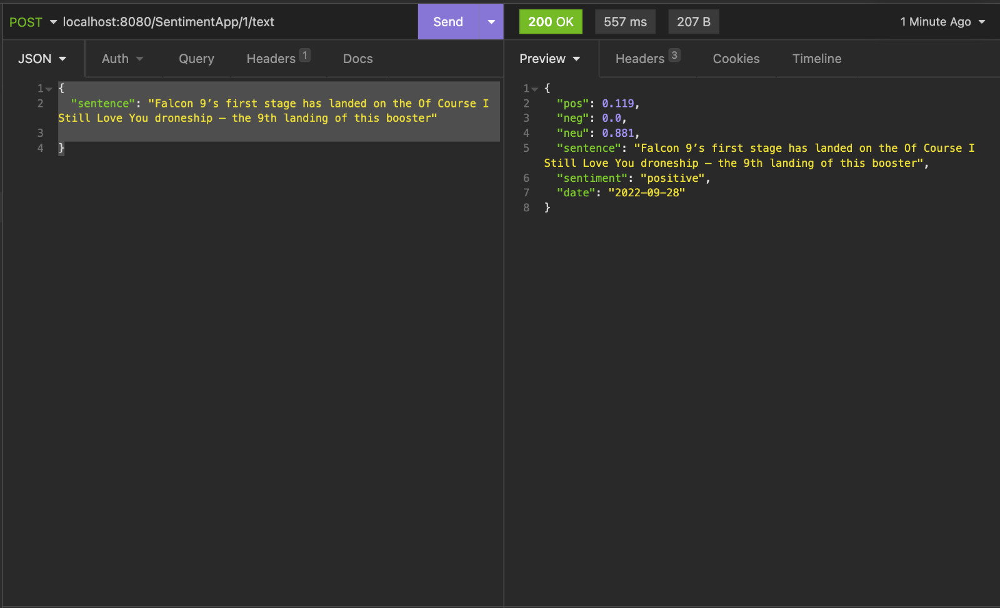

<h1 align="center"> Sentiment Analysis </h1>

### Table of contents

[Project Description ��](#project-Description)
 [Setup ⚙️](#setup)
 [Features ��](#setup)

---

### Project Description

Sentiment Analysis is a project using java framework - Spring Boot. This was a group project, created in less than a 
week, for the MindSwap bootcamp at Mindera. The main goal of this project is to analyse the different types of sentiments 
present in a given text using an external API called "Text Sentiment Analysis App". 

After the user writes his thoughts, the percentage of positive, negative and neutral words 
contained in the text is returned. Simultaneously, the application returns the predominant feeling based on the highest 
percentage of the words analysed as well as the date on which the text was written.

The idea of this project is to create a mental health diary, which can be used daily to monitor the different types of 
thoughts in order to perform a mental evaluation on each user.

---

### Setup 

In order to use this application, it is necessary to follow the specific order:

- Run the server

- Create a new user account according to the specified parameters (First name, Last name, age, city, gender), which will be stored in the database

- Type your text

 

---

### Features 

- Write a text (1000 characters limit)
- Feel free to write what ever you want 
- Access to the texts database  

Future features:

- Weakly info of the sentiments analysed
- Different types of recommendations based on the percentage of negative values (playlist, podcasts)

